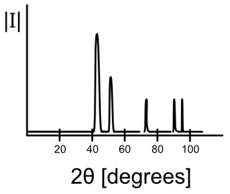
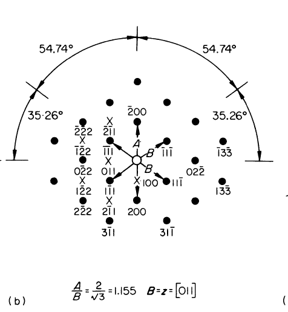

# Introduction to Stacking Faults:

# Lesson Plan:

## Learning Objectives:
- Students will be able to describe how planes move to create stacking faults

## Lesson

## Nanoquiz (10 min)
Students are expected to arrive on time so that they have enought time to complete the nanoquiz.
### Question 1
Name the different types of stacking faults observed in face-centered cubic structures and either describe or draw how the stacking order is different

### Question 2
Draw or describe how a stacking fault might look like with TEM Bright field imaging. Why does it look like this? Feel free to use a speech-to-text software for your description, such as https://utterlyvoice.com

## Mini Lecture (15 min)
Today for the mini lecture we will briefly go over stacking faults as a review of the at home reading.

## Activity \# 1 (12 min total including debrief)

On your desk, you should havea a clear box, and several sheets of colored ping pong balls glued together. These sheets are colored to help you better visualize the different 111 planes of an fcc lattice. Use these supplies to visualize how planes must move to create a stacking fault. It may be useful to work with your neighbor, where one of your physical models represents ABCABC stacking and the other represents ABAB stacking.
#### Learning Objectives addressed by this activity:
- 
### Debrief (2 min)

## Activity \# 2 (12 min total including debrief)

With a partner, discuss how you think stacking faults will affect diffraction. Either describe this in writing or draw a schematic plot of what you think x-ray diffraction or electron diffraction patterns might look like from a material containing stacking faults.

We've included a picture below of what a XRD plot and TEM diffraction pattern look like for an FCC material for reference.

![FCC [011] ZA TEM Diffraction Pattern](./images/FCC_011_TEM_DP.png)
 This image was taken from the chem.libretexts [website](https://chem.libretexts.org/Bookshelves/Inorganic_Chemistry/Introduction_to_Solid_State_Chemistry/06%3A_Recitations/6.16%3A_X-ray_Diffraction_and_Selection_Rules)

FCC X-ray Diffraction Spectrum          |  FCC [011] ZA TEM Diffraction Pattern
:-------------------------:|:-------------------------:
  |  

Sources:
chem.libretexts [website](https://chem.libretexts.org/Bookshelves/Inorganic_Chemistry/Introduction_to_Solid_State_Chemistry/06%3A_Recitations/6.16%3A_X-ray_Diffraction_and_Selection_Rules)

Edington, J. W. (1975). Electron Diffraction in the Electron Microscope. Red Globe Press. https://doi.org/10.1007/978-1-349-02595-4

#### Learning Objectives addressed by this activity:
- 

### Debrief (2 min)

## Wrap-Up (1 min)
Reminders and send off

